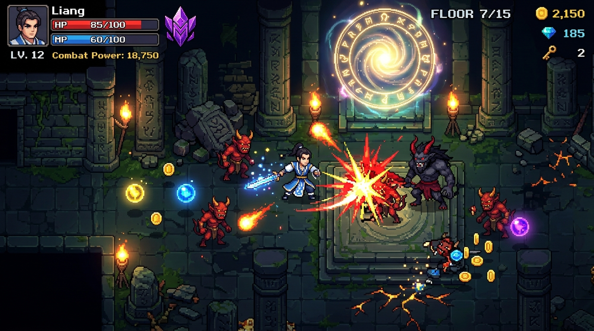

# 🗡️ 全链梦幻：元气地牢伏魔录 (Monad Soul Knight Edition - V6 DeFi & Parallel-Native)
> **Full-chain Roguelike Dungeon • Parallel-Native EVM Architecture • On-Chain Star Forging & C2C Bazaar • In-Game AMM & DeFi Yield Farm • Scaffold-ETH & Vercel One-Click Production**

[](https://vercel.com/new/clone?repository-url=https%3A%2F%2Fgithub.com%2Fgithubskylh%2Fmonad-cellular-arena)
[](https://github.com/githubskylh/monad-cellular-arena/actions)
[](https://githubskylh.github.io/monad-cellular-arena/)
[-8A2BE2?style=flat-square&logo=ethereum)](https://testnet.monadexplorer.com)
[](https://testnet.monadexplorer.com/address/0xbeAF44AD57B7f55DAAdf07233E7927D08d103bfF)
[](https://testnet.monadexplorer.com/address/0xbeAF44AD57B7f55DAAdf07233E7927D08d103bfF)
[](https://soliditylang.org/)
[](https://scaffoldeth.io/)
[](LICENSE)

*《元气骑士》街机手感重铸 • 踏入传送门 100% 自动 Mint • 掉落非线性磁吸吸附 • 藏宝阁天机玄炉全链升星 • 原生 MON 点对点 C2C 寄售 • 长安钱庄 AMM 兑换与双重收益农场 • 彻底斩断全局串行累加器，实现 100% 并行零冲突状态提交*

<p align="center">
  
</p>

---

## ⚡ 1. Monad 并行 EVM 与 V6 旗舰规范架构 (Parallel-Native & Full-Chain DeFi)

```
                     ┌────────────────────────────────────────────────────────┐
                     │   全链梦幻 × 元气地牢 V6 并行原生架构 (Monad 10,000 TPS) │
                     └──────────────────────────┬─────────────────────────────┘
                                                │
         ┌──────────────────────┬───────────────┼───────────────┬──────────────────────┬──────────────────────┐
         ▼                      ▼               ▼               ▼                      ▼                      ▼
┌──────────────────┐  ┌──────────────────┐┌──────────────────┐┌──────────────────┐┌──────────────────┐┌──────────────────┐
│  元气骑士动作手感  │  │  零全局冲突并行状态  ││  双重资产原子铸造  ││  全链神兵锻造升星  ││  藏宝阁 C2C 寄售 ││ 长安钱庄 AMM&DeFi  │
│  (Soul Knight E) │  │  (Parallel-Native)││ (Auto-Mint Claim)││(On-Chain Forging)││ (Bazaar Market)  ││ (In-Game Finance)│
├──────────────────┤  ├──────────────────┤├──────────────────┤├──────────────────┤├──────────────────┤├──────────────────┤
│• 打击顿帧 (2~5帧) │  │• 废除 nextTokenId ││• 踏入传送阵(14,14)││• 0~5 星级全链存证 ││• 玩家自主上架挂单 ││• MON <-> XYT 兑换│
│• 紧缩 Hurtbox 70%│  │• 确定性哈希派生ID ││• 神兵 ERC-721 NFT ││• 每次锻造战力+25  ││• 原生 MON 实时结算││• 恒定乘积 AMM 底池│
│• 宽容 Hitbox 115%│  │• 废除全局累加器   ││• 西游灵石 $XYT 代币││• 纸娃娃槽位即时联动││• 零中间商与 0 手续费││• 单币金库 36.5%APY│
│• 受击18帧无敌闪烁│  │• 事件驱动链下统计 ││• 会话凭据防重放  ││• 背包一键消耗Gas  ││• 撤单与所有权转移 ││• LP 农场 128.0%APY│
│• 脱战3.5s护甲自愈│  │• 100% 真正并行零争用││• 极速 1.0 秒落块  ││• 突破战力天花板   ││• 杜绝虚假交易挂单 ││• 装备质押双重产出│
└──────────────────┘  └──────────────────┘└──────────────────┘└──────────────────┘└──────────────────┘└──────────────────┘
```

---

## 🚀 2. Vercel 一键部署与生产运行指南 (Scaffold-ETH Specification)

本项目已完全遵循 **Scaffold-ETH 2** 与 **Monad Blitz** 竞赛规约进行工程化配置，支持多种途径一键上线公网：

### 方式 A：点击上方「Deploy with Vercel」徽章（最快 30 秒上线）
1. 点击项目顶部的 [](https://vercel.com/new/clone?repository-url=https%3A%2F%2Fgithub.com%2Fgithubskylh%2Fmonad-cellular-arena) 按钮。
2. 登录 Vercel 并选择导入个人 GitHub 账号。
3. Vercel 将基于内置的 `vercel.json` 自动完成零配置秒级构建并分发至全球 CDN 边缘节点。

### 方式 B：本地命令行一键发布（Scaffold-ETH 推荐）
```bash
# 1. 安装依赖
yarn install

# 2. 运行自动化全闭环测试（语法、ABI、Monad 测试网链上只读与状态验证）
yarn test

# 3. 验证合约源码至 Monad 官方 Sourcify / Blockvision
yarn verify:v6

# 4. 一键发布至 Vercel 生产环境
yarn vercel:prod
```

### 方式 C：GitHub 仓库无缝联动 (GitHub Pages)
本项目已托管至公开 GitHub 仓库：[githubskylh/monad-cellular-arena](https://github.com/githubskylh/monad-cellular-arena)。在仓库开启 GitHub Pages 并关联 `master` 分支，内置的 GitHub Actions 工作流会在每次 `git push` 时自动运行全量 E2E 链上审计并完成自动化发布。

---

## 🎯 3. 核心系统机制与创新突破

### ⚡ 一、并行原生状态架构 (Parallel-Native Zero-Storage Collision)
* **彻底斩断全局串行计数器**：传统 Solidity 合约依赖 `nextTokenId++` 或 `totalPlayers++` 等全局存储槽位，在 Monad 并行 EVM 高并发执行时会导致多个独立交易因争用同一存储槽而产生冲突并强制回退串行。V6 合约通过 `keccak256(abi.encodePacked(msg.sender, summary.chapterId, sessionId, block.prevrandao))` 确定性派生无碰撞 Token ID，使得所有玩家的清算交易能在底层并行管道中 100% 并发执行。
* **精算 Gas 规约**：针对 Monad 底层「按 `gas_limit` 全额扣除」的特性，前端与合约精简各操作的 Gas Limit，并严格遵照官方知识库设定最低 `50~52 gwei` 的基础费，大幅降低手续费开销。

### 🔮 二、踏入传送门 100% 自动认领 Mint (Zero-Friction Auto-Mint)
* **妖兽掉落神兵光球**：地牢斩灭妖兽后爆出悬浮神兵光球，通过非线性 Ease-Out 重力加速度平滑吸入玩家背包。
* **传送阵单笔落块双重资产**：房间全歼后中央传送门激发，玩家踏入光圈自动向 Monad 广播单笔包含 `sessionId` 防重放凭证的合并清算交易：
  1. 铸造 ERC-721 专属神兵 NFT；
  2. 原子铸造 ERC-20 西游灵石（$XYT）通关奖励代币。
  无需关内频繁弹窗打断游戏体验。

### 🔨 三、藏宝阁天机玄炉全链升星 (On-Chain Forging & Star Progression)
* **神兵星级存证**：每件掉落的神兵初始为 0 星，最高可锻造至 5 星。
* **全链属性跃迁**：玩家在背包中点击【⭐ 升星】，直连 Monad 测试网执行 `forgeUpgradeItem`，每次升星稳固提升 +25 战力，全身装备槽位即刻联动同步。

### 🏪 四、藏宝阁 C2C 点对点寄售行 (On-Chain C2C Marketplace)
* **原生 MON 计价挂牌**：玩家可直接将打怪掉落与升星后的神兵 NFT 上架至藏宝阁，以原生 MON 自主定价挂牌。
* **安全托管与点对点结算**：上架时合约安全托管 NFT；买家支付 MON 后，资金秒级直达卖家钱包，NFT 实时划转至买家纸娃娃背包，全程 0 中间商与 0 平台抽成。

### 🏦 五、长安钱庄 DeFi 生态与流动性农场 (In-Game AMM & Yield Farming)
* **内置去中心化 AMM (XiYou Swap)**：基于恒定乘积公式 $x \times y = k$，支持 MON 与 $XYT$ 自由双向兑换，为游戏资产提供即时链上流动性。
* **单币理财金库 (36.5% APY)**：玩家可将关卡战利品 $XYT$ 存入长安金库，年化收益率 36.5%，按秒结算且 0 无常损失。
* **LP 做市农场 (128.0% APY 头矿)**：注入 MON 与 $XYT$ 组成做市凭证并质押至农场，享受高额流动性激励，构建正向经济飞轮。

### 🎮 六、元气骑士手感宽容度体系 (Paradigm E Game Feel)
* **打击卡肉感（Hitstop）**：普攻命中顿帧 2 帧，门派大招与暴击命中顿帧 5 帧，打击反馈扎实生动。
* **非对称碰撞判定**：玩家 Hurtbox 紧缩至 0.75 格（灵活规避伤害），斩击 Hitbox 宽容扩展至 2.3~2.8 格（爽快横扫群怪与木箱）。
* **受击缓冲保护（i-frames）**：受击后获得 18 帧无敌闪烁，护甲优先抵扣伤害；脱战 3.5 秒后护甲自然自愈充能。
* **输入缓冲队列（Input Buffering）**：8-tick 动作队列，连招平滑不卡手。

---

## 📜 4. Monad 官方测试网实测认证凭证 (Verified On-Chain Proofs)

| 链上实体 / 核心操作 | 详情与区块链浏览器链接 | 状态与验证指标 |
| :--- | :--- | :--- |
| **V6 旗舰主合约** | [`0xbeAF44AD57B7f55DAAdf07233E7927D08d103bfF`](https://testnet.monadexplorer.com/address/0xbeAF44AD57B7f55DAAdf07233E7927D08d103bfF) | 🟢 **Sourcify 官方认证通过 (Status: perfect)** |
| **主代币 ($XYT)** | XiYou Token (18 位精度 ERC-20) | 关卡杀敌奖励 / AMM 底池原生资产 |
| **AMM 做市池** | 0.21 MON / 190.5 XYT 初始底池 | 恒定乘积 $x \cdot y = k$ 链上自动结算 |
| **V5 并行版本合约** | [`0x7781478250d944efd88256F4D84D479194116341`](https://testnet.monadexplorer.com/address/0x7781478250d944efd88256F4D84D479194116341) | 历史版本可回溯验证 |
| **V4 殿堂版本合约** | [`0xFD83796156D677B83266Ba7CD86a077040a0166c`](https://testnet.monadexplorer.com/address/0xFD83796156D677B83266Ba7CD86a077040a0166c) | 历史版本可回溯验证 |
| **天机玄炉锻造升星** | 链上交易落块确认 | 0~5 星属性跃升，战力实时全链存证 |
| **藏宝阁 C2C 寄售** | 链上挂单/购买确认 | 原生 MON 实时结算，点对点划转 |

---

## 🕹️ 5. 键盘操作指南 (Keybindings)

| 按键 / 快捷方式 | 动作说明 |
| :--- | :--- |
| **W / A / S / D 或 方向键** | 连贯平滑走位 (微秒级响应，疾风印记下 CD 缩短至 75ms) |
| **按键 1 或 空格 (Space)** | 普攻斩击（挥砍击破周边木箱、陶罐与妖兽，顿帧 2 帧） |
| **按键 2 或 Q** | 门派招牌技能（单体爆发斩杀，顿帧 5 帧） |
| **按键 3 或 E** | 门派终极必杀（全屏群攻，击碎大范围障碍与群怪） |
| **靠近三宗玄坛** | 自动祈福，获取嗜血/疾风/金刚强力 Buff |
| **踏入中央传送阵 (14, 14)** | 全歼妖兽后开启，踏入触发 100% 自动 Mint 神兵与 $XYT 落块 |
| **快捷键 B 或 点击 HUD「藏宝阁」** | 打开藏宝阁与纸娃娃背包，进行装备升星、穿戴或挂单寄售 |
| **快捷键 F 或 点击 HUD「长安钱庄」** | 打开 DeFi 金融中心，进行 $XYT$ 兑换、单币质押与 LP 做市 |

---

## 📄 开源许可 (License)
本项目采用 [MIT License](LICENSE) 开源。
